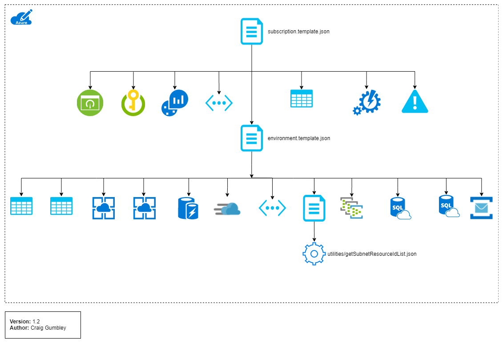

# Apprenticeship Service Shared Infrastructure

|  | Status |
|-------------|--------|
| Build (Master) | [](https://dev.azure.com/sfa-gov-uk/Apprenticeships%20Service%20Cloud%20Platform/_build/latest?definitionId=1662&branchName=master)
| DTA |  |
| Dev/Test |  |
| PP |  |
| PRD |  |
| MO |  |

The templates hosted in this repository facilitate the deployment of the shared infrastructure for the Apprenticeships Service.

The deployment consists of two layers.

### Subscription layer
The subscription layer owns resources that are shared horizontally across a subscription and are used for management purposes. For example, Log Analytics, Azure Automation, KeyVault, Storage, Alerting, Dashboards etc.

**Note**: A subscription can contain one or more environments.

### Environment layer
The environment layer owns resources that are shared vertically across an environment and are typically used to provide a platform for other independent applications. For example; App Service Plans, Virtual Networks, SQL Servers, ServiceBus etc.

## External dependencies
There is a third layer that is not deployed by these templates. This is the application layer. Deployment templates for applications within this layer are typically stored with the [application code](https://github.com/SkillsFundingAgency/das-reservations/tree/master/azure) as they will share the same lifecycle. These applications will often depend on infrastructure deployed by templates in this repository.

Both shared and application deployments consume templates from the [platform building blocks](https://github.com/SkillsFundingAgency/das-platform-building-blocks) repository.

## Logical view
The diagram below is a logical representation of the deployment template structure.



## Deployment

### Azure DevOps deployments
This is the primary method used to deploy the infrastructure. Configuration is stored securely either in the build definition or variable groups and versioned artifacts are used when deploying.

### Local deployment
 To deploy from your local machine, set each parmeter as an environment variable then run the script below.

``` PowerShell
.\Initialize-SharedInfrastructureDeployment.ps1
```

The expected environment variable names can be found in the **metadata** object for each parameter in [subscription.template.json](templates/subscription.json).

For example:

``` Javascript
"resourceEnvironmentName": {
    "type": "string",
    "metadata": {
        "description": "Base environment name. E.g. DEV. PP, PRD, MO. ",
        "environmentVariable": "resourceEnvironmentName"
    }
}
```

**Note**: This deployment method should ***only*** be used for testing purposes.

## Testing

Use the unit test runner to execute tests. The LocalDeployment switch will execute tests in a new process to avoid polluting the current runspace.

```PowerShell
.\Start-UnitTest.ps1 -LocalDeployment
```

You can specify specific tests by using the Path parameters.

```PowerShell
.\Start-UnitTest.ps1 -Path .\Initialize-SharedInfrastructureDeployment.tests.ps1 -LocalDeployment
```

The example above will execute the end to end mock deployment test.

New tests are automatically invoked at build time and the run will produce a test report which is published back to azure-pipelines in the context of the build.
