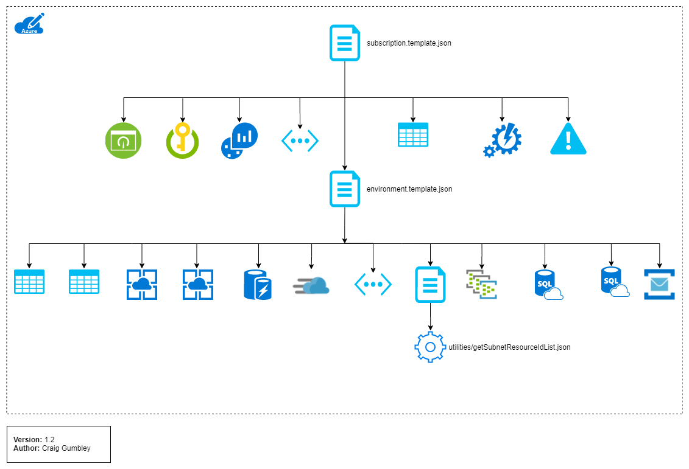

# Apprenticeship Service Shared Infrastructure

|  | Status |
|-------------|--------|
| Build (Master) | [](https://dev.azure.com/sfa-gov-uk/Apprenticeships%20Service%20Cloud%20Platform/_build/latest?definitionId=4309&repoName=SkillsFundingAgency%2Fdas-shared-infrastructure&branchName=master)
| DTA | [](https://dev.azure.com/sfa-gov-uk/Apprenticeships%20Service%20Cloud%20Platform/_build/latest?definitionId=4309&repoName=SkillsFundingAgency%2Fdas-shared-infrastructure&branchName=master) |
| Dev/Test | [](https://dev.azure.com/sfa-gov-uk/Apprenticeships%20Service%20Cloud%20Platform/_build/latest?definitionId=4309&repoName=SkillsFundingAgency%2Fdas-shared-infrastructure&branchName=master) |
| AT | [](https://dev.azure.com/sfa-gov-uk/Apprenticeships%20Service%20Cloud%20Platform/_build/latest?definitionId=4309&repoName=SkillsFundingAgency%2Fdas-shared-infrastructure&branchName=master) |
| TEST | [](https://dev.azure.com/sfa-gov-uk/Apprenticeships%20Service%20Cloud%20Platform/_build/latest?definitionId=4309&repoName=SkillsFundingAgency%2Fdas-shared-infrastructure&branchName=master) |
| TEST2 | [](https://dev.azure.com/sfa-gov-uk/Apprenticeships%20Service%20Cloud%20Platform/_build/latest?definitionId=4309&repoName=SkillsFundingAgency%2Fdas-shared-infrastructure&branchName=master) |
| DEMO | [](https://dev.azure.com/sfa-gov-uk/Apprenticeships%20Service%20Cloud%20Platform/_build/latest?definitionId=4309&repoName=SkillsFundingAgency%2Fdas-shared-infrastructure&branchName=master) |
| PP | [](https://dev.azure.com/sfa-gov-uk/Apprenticeships%20Service%20Cloud%20Platform/_build/latest?definitionId=4309&repoName=SkillsFundingAgency%2Fdas-shared-infrastructure&branchName=master) |
| MO | [](https://dev.azure.com/sfa-gov-uk/Apprenticeships%20Service%20Cloud%20Platform/_build/latest?definitionId=4309&repoName=SkillsFundingAgency%2Fdas-shared-infrastructure&branchName=master) |
| PROD | [](https://dev.azure.com/sfa-gov-uk/Apprenticeships%20Service%20Cloud%20Platform/_build/latest?definitionId=4309&repoName=SkillsFundingAgency%2Fdas-shared-infrastructure&branchName=master) |

The templates hosted in this repository facilitate the deployment of the shared infrastructure for the Apprenticeships Service.

The deployment consists of two layers.

### Subscription layer
The subscription layer owns resources that are shared horizontally across a subscription and are used for management purposes. For example, Log Analytics, Azure Automation, KeyVault, Storage, Alerting, Dashboards etc.

**Note**: A subscription can contain one or more environments.

### Environment layer
The environment layer owns resources that are shared vertically across an environment and are typically used to provide a platform for other independent applications. For example; App Service Plans, Virtual Networks, SQL Servers, ServiceBus etc.

## Shared Log Analytics workspaces

Each environment has two shared Log Analytics workspaces, deployed into `das-{env}-shared-rg` by [environment.template.json](templates/environment.template.json) from the reusable [log-analytics-workspace-v2.json](https://github.com/SkillsFundingAgency/das-platform-building-blocks/blob/master/templates/log-analytics-workspace-v2.json) building block.

| Workspace | Purpose | Analytics retention | Total retention |
| --- | --- | --- | --- |
| `das-{env}-operational-la` | Availability, performance and troubleshooting telemetry | `operationalLogAnalyticsRetentionInDays` (default 90) | same |
| `das-{env}-security-la` | Audit and security relevant resource logs | `securityLogAnalyticsRetentionInDays` (default 90) | `securityLogAnalyticsTotalRetentionInDays` (default 365) |

Data between the analytics retention and the total retention is held in low cost long term retention and retrieved with a [search job](https://learn.microsoft.com/azure/azure-monitor/logs/search-jobs). Both values can be changed later without data loss - increasing total retention applies to data already ingested, and shortening it has a 30 day grace period before removal.

Both workspaces are deployed with `disableLocalAuth` set, so only Microsoft Entra authentication is accepted and shared key ingestion is rejected, per LLD 5.1. Nothing is onboarded to either workspace yet, so there is no existing shared key path to break - but note that the legacy HTTP Data Collector API and the old MMA agent both rely on shared keys and would not work against these workspaces.

These are new workspaces. The pre-existing per subscription workspace (`logAnalyticsWorkspaceName`, in `das-{sub}-mgmt-rg`) is unchanged and still receives Application Insights, Service Bus and Event Hub diagnostics.

### Long term retention and the table list

Long term retention is applied per table via `securityLogAnalyticsTableNames`, which defaults to `AzureDiagnostics,AZKVAuditLogs,AzureActivity`.

Built in tables are **pre registered by schema** in a Log Analytics workspace rather than created on first ingestion - a workspace created in April 2025 that has only ever received firewall logs still carries 685 tables, including ones it has never had data in. Long term retention can therefore be applied from deployment, before any resource is onboarded, and retention on an empty table costs nothing because it is billed per GB retained.

The default covers both routes Key Vault audit logs can take, so whichever the onboarding ticket chooses is already retained:

| Table | Populated when |
| --- | --- |
| `AzureDiagnostics` | A diagnostic setting uses the default destination type |
| `AZKVAuditLogs` | A diagnostic setting sets `logAnalyticsDestinationType: Dedicated` |
| `AzureActivity` | Subscription activity log is exported to the workspace |

`AzureDiagnostics` is a shared table that many resource types write into, so anything retained or exported from it applies to all of them. `AZKVAuditLogs` is Key Vault only and can be targeted precisely. Prefer the resource specific route for anything sent to the security workspace, because data export cannot filter rows.

Note that not every table is pre registered - agent and solution driven tables such as `SecurityEvent` only appear once their source exists.

The three table list settings (`securityLogAnalyticsTableNames`, `securityLogArchiveTableNames`, `securityLogSplunkTableNames`) are comma separated strings rather than arrays, because the parameters file builder treats an empty array as a missing value and throws. `none` means no tables. Spaces are stripped, so `SecurityEvent, AzureActivity` and `SecurityEvent,AzureActivity` are equivalent.

### Immutable archive

`Microsoft.OperationalInsights/workspaces` has no immutability property. Tamper protection follows [Microsoft's documented pattern](https://learn.microsoft.com/azure/azure-monitor/logs/logs-data-export): a [data export rule](https://github.com/SkillsFundingAgency/das-platform-building-blocks/blob/master/templates/log-analytics-workspace-data-export.json) writes the security tables to a storage account with a WORM immutability policy, deployed by [storage-account-immutable.json](https://github.com/SkillsFundingAgency/das-platform-building-blocks/blob/master/templates/storage-account-immutable.json) as `das{env}securitystr`.

`securityLogAnalyticsImmutabilityPolicyState` controls the policy:

| State | Behaviour |
| --- | --- |
| `Disabled` | No immutability. **Required for DTA**, which is torn down and rebuilt by [Remove-Environment.ps1](tests/Remove-Environment.ps1). |
| `Unlocked` | Protects against overwrite. Can still be removed and the account deleted. |
| `Locked` | **Irreversible.** The blobs, container, storage account and resource group cannot be deleted until the immutability period expires. Cannot be overridden by subscription administrators or Microsoft Support. |

A policy can only be created `Disabled` or `Unlocked`; only an `Unlocked` policy can transition to `Locked`. Roll out `Unlocked` first, confirm the export is landing blobs, then move approved environments to `Locked` with the approval recorded.

### Naming

Resource names follow [Appendix A of the LLD](#), which names by purpose rather than by resource group:

| Resource | Name |
| --- | --- |
| Security workspace | `das-{env}-security-la` |
| Operational workspace | `das-{env}-operational-la` |
| Security log archive storage | `das{env}securitystr` |
| Splunk Event Hubs namespace | `das-{env}-security-ehns` |

Two deviations from the LLD worth knowing:

The environment token comes from the pipeline's `EnvironmentNames`, so production is **`das-prd-security-la`**, not the `das-prod-security-la` written in LLD 4.1 and 18. `prd` is the token every other resource in that subscription uses, so the LLD rows look like the error.

LLD 5.1 asks for a `das-{env}-monitoring-rg`. These deploy into the existing `das-{env}-shared-rg` instead, which 5.1 explicitly permits where the subscription model already uses a different shared resource group. The names do not carry a `shared` token, because the LLD names by purpose.

### Resource locks

`securityLogAnalyticsResourceLockLevel` and `operationalLogAnalyticsResourceLockLevel` apply a `CanNotDelete` lock to their respective workspace. Both default to `None` and are enabled per environment through configuration.

They are separate parameters because LLD 18 asks for different treatment: `CanNotDelete` on the security workspace in **every** environment, but on the operational workspace only in PP, Prod and MO.

A resource lock prevents the workspace being deleted but **does not prevent a data purge**, which is a separate permission. It therefore complements the immutable archive rather than replacing it - the WORM copy is what makes the exported logs tamper protected.

### Splunk

Security logs reach Splunk **from the security workspace**, not direct from each resource. A data export rule streams the tables named in `securityLogSplunkTableNames` to an Event Hubs namespace, which Splunk consumes.

Note the estate already has a second, different route: `Splunk_Diagnostic_Profile` diagnostic settings send straight from resource to Event Hub, bypassing Log Analytics. That route is not used here - the workspace is the source, so everything Splunk receives is also retained and archived under the same policy. The trade off is that data export is billed per GB exported, on top of workspace ingestion.

Data export **cannot filter rows**, so the selection is a table list. Resource specific tables such as `AZKVAuditLogs` can be targeted precisely; the shared `AzureDiagnostics` table cannot, because everything written into it by any resource type is exported together.

Security logs reach Splunk through a second data export rule targeting an Event Hubs namespace, consumed by the Splunk Add-on for Microsoft Cloud Services. It is off by default (`deploySecurityLogSplunkExport`) until the Splunk side is listening, because exporting to a destination that is not consuming the data costs money for no benefit.

`deploySecurityLogSplunkEventHubNamespace` optionally deploys a dedicated `das-{env}-security-ehns` namespace with a Listen only `splunk-listen` authorization rule, and points the export at it automatically. Microsoft advise against exporting monitoring data into a namespace carrying other traffic, so this is preferred over reusing `das-{env}-shared-eh`. If Splunk already consumes an existing namespace, leave it `Disabled` and set `securityLogSplunkEventHubNamespaceResourceId` instead.

The Listen key is deliberately not an ARM output, because deployment outputs are readable by anyone with Reader on the resource group. Retrieve it on demand with `az eventhubs namespace authorization-rule keys list`.

Data export cannot filter rows - it exports whole tables from the point the rule is created - so targeting is expressed as a short list of tables in `securityLogSplunkTableNames`. `securityLogSplunkEventHubNamespaceResourceId` is supplied by configuration so an existing namespace can be reused. Both Splunk string parameters use `none` rather than an empty string as their unset value, because the parameters file builder treats empty values as missing.

## External dependencies
There is a third layer that is not deployed by these templates. This is the application layer. Deployment templates for applications within this layer are typically stored with the [application code](https://github.com/SkillsFundingAgency/das-reservations/tree/master/azure) as they will share the same lifecycle. These applications will often depend on infrastructure deployed by templates in this repository.

Both shared and application deployments consume templates from the [platform building blocks](https://github.com/SkillsFundingAgency/das-platform-building-blocks) repository.

## Logical view
The diagram below is a logical representation of the deployment template structure.



## Deployment

### Azure DevOps deployments
This is the primary method used to deploy the infrastructure. Configuration is stored securely either in the build definition or variable groups and versioned artifacts are used when deploying.

### Local deployment
 To deploy from your local machine, set each parameter as an environment variable then run the script below.

``` PowerShell
.\Initialize-SharedInfrastructureDeployment.ps1
```

The expected environment variable names can be found in the **metadata** object for each parameter in [subscription.template.json](templates/subscription.json).

For example:

``` Javascript
"resourceEnvironmentName": {
    "type": "string",
    "metadata": {
        "description": "Base environment name. E.g. DEV. PP, PRD, MO. ",
        "environmentVariable": "resourceEnvironmentName"
    }
}
```

**Note**: This deployment method should ***only*** be used for testing purposes.

## Testing

Use the unit test runner to execute tests. The LocalDeployment switch will execute tests in a new process to avoid polluting the current runspace.

```PowerShell
.\Start-UnitTest.ps1 -LocalDeployment
```

You can specify specific tests by using the Path parameters.

```PowerShell
.\Start-UnitTest.ps1 -Path .\Initialize-SharedInfrastructureDeployment.tests.ps1 -LocalDeployment
```

The example above will execute the end to end mock deployment test.

New tests are automatically invoked at build time and the run will produce a test report which is published back to azure-pipelines in the context of the build.

## DTA Deployment

The DTA stage deploys and tears down the infrastructure to provide a method for testing the deployment process without interferring with the availablity of the AT environment.

### Building block dependency

The templates above live in [das-platform-building-blocks](https://github.com/SkillsFundingAgency/das-platform-building-blocks) and are resolved from that repository's `master` branch at deployment time, not from the pinned tag in [azure-pipelines.yml](azure-pipelines.yml). The tag governs the pipeline YAML step templates only, so a building blocks change is live for every consumer on merge.

They are all **new files**. The pre-existing `log-analytics-workspace.json` is untouched and stays on apiVersion `2020-08-01`, so nothing that already consumes it is affected. `log-analytics-workspace-v2.json` is a second template following the same `-v2` convention as `app-service-v2.json` and `app-gateway-v2.json`.
